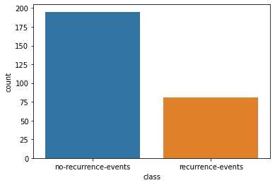
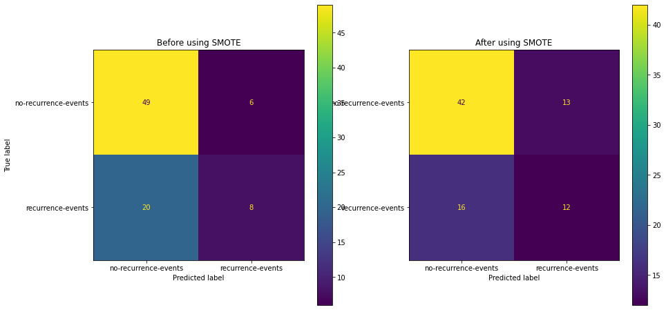

# Breast Cancer Analysis & Prediction
[](https://share.streamlit.io/nmtrang/breast-cancer-analysis/app.py)


## Appendix
- [Introduction](#Introduction)
- [Re-organizing the dataset](#Reorganizing-the-dataset)
- [Exploratory Data Analysis](#Exploratory-Data-Analysis)
- [Tackle imbalanced dataset](#Tackle-imbalanced-dataset)
- [Model stacking](#Model-stacking)


## Introduction

### Data source: https://archive.ics.uci.edu/ml/datasets/Breast+Cancer

### Attributes description:
- ``menopause`` (nominal): the time that marks the end of a person's menstrual cycle.
- ``age`` (range): the age of the patient.
- ``tumor-size`` (in mm) (range): the size of the tumor in the patient.
- ``inv-nodes`` (range): the number of axillary lymph nodes that contain metastatic breast cancer visible on histological examination.
- ``node-caps`` (binary): 
- ``deg-malig`` (numerical): the histological grade of the tumor. Tumors that a grade 1 predominantly consist of cells that, while neoplastic, retain many of their usual characteristics. Grade 3 tumors predominately consist of cells that are highly abnormal.
- ``breast`` (nominal): the side of breast that the patient has had the most malignant tumor, may occur in either breast.
- ``breast-quad`` (nominal): the quadrant of the breast that the patient has had the most malignant tumor.
- ``irradiate`` (binary): whether the patient has had radiation therapy to destroy cancer cells.

## Reorganizing the dataset

This dataset is of file type ``.data`` which we will see it'll become like this if reading with pandas - ``read_fwf()``

**Check rebuild-dataset.ipynb for more**

After re-organizing the value, final result will look like this:


## Exploratory Data Analysis
We notice abitruary values in some columns so let's clean it.

There are 3 range data columns: ``age``, ``tumor-size``, ``inv-nodes``.

There are 5 nominal data columns: ``menopause``, ``node-caps``, ``irradiat``, ``breast``, ``breast-quad``.

There is only 1 numerical data column: ``def-malig``.

However we can consider ``def-malig`` as a categorical data column

The class/label is ``class`` with ``no-recurrence-events`` and ``recurrence-events``.

## Tackle imbalanced dataset

<<<<<<< HEAD
### Initial imbalance



### I used Logistic Regression as baseline model to evaluate the model before and after using SMOTE technique.

### The confusion matrix turned out like this. 



### And the metrics before and after using SMOTE

```python
---------- Before using SMOTE ----------
[[49  6]
 [20  8]]
                      precision    recall  f1-score   support

no-recurrence-events       0.71      0.89      0.79        55
   recurrence-events       0.57      0.29      0.38        28

            accuracy                           0.69        83
           macro avg       0.64      0.59      0.59        83
        weighted avg       0.66      0.69      0.65        83


---------- After using SMOTE ----------
[[42 13]
 [16 12]]
                      precision    recall  f1-score   support

no-recurrence-events       0.72      0.76      0.74        55
   recurrence-events       0.48      0.43      0.45        28

            accuracy                           0.65        83
           macro avg       0.60      0.60      0.60        83
        weighted avg       0.64      0.65      0.65        83

```

## Model stacking

### K-Nearest neighbor

#### In this project, I used the metrics of accuracy, Mathew's Coefficient and F1 score

```python
Model performance for training set
Accuracy: 0.8090909090909091
MCC: 0.513205391695839
F1 score: 0.7989883592017737
--------------------------------------
Model performance for test set
Accuracy: 0.7321428571428571
MCC: 0.2613838422748508
F1 score: 0.7054187192118225
```

### Support Vector Machine

```python
Model performance for training set
Accuracy: 0.9772727272727273
MCC: 0.9451890389839106
F1 score: 0.9771132115601437
--------------------------------------
Model performance for test set
Accuracy: 0.7321428571428571
MCC: 0.21320071635561041
F1 score: 0.6351172047766476
```

### Neural Network

```python
Model performance for training set
Accuracy: 0.7727272727272727
MCC: 0.4125812950947179
F1 score: 0.7589531680440773
--------------------------------------
Model performance for test set
Accuracy: 0.7142857142857143
MCC: 0.27386127875258304
F1 score: 0.708246225319396
```

### Building stacked model

```python
Model performance for training set
Accuracy: 0.8772727272727273
MCC: 0.705610890403457
F1 score: 0.8661034882837769
--------------------------------------
Model performance for test set
Accuracy: 0.7321428571428571
MCC: 0.21320071635561041
F1 score: 0.6351172047766476
```

### Results
#### The final results of each model with 3 metrics of evaluation
```python
	    Accuracy	MCC	        F1
knn	    0.809091	0.513205	0.798988
svm	    0.977273	0.945189	0.977113
mlp	    0.772727	0.412581	0.758953
stack	0.877273	0.705611	0.866103
```

### Dump the model to pickle file for deployment

```python
with open('../svm_model', 'wb') as f:
    mp = pickle.dump(svm, f)
```
